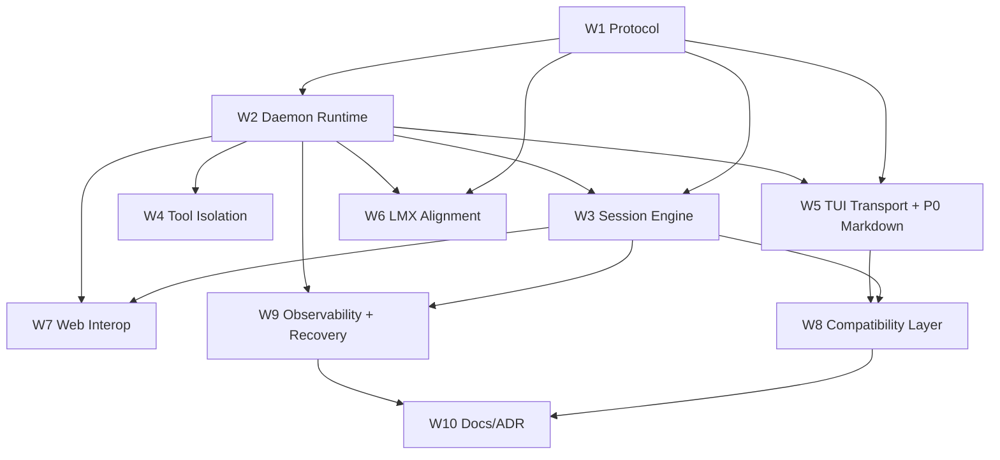

# Opta CLI Level 3 Program Plan (Direct L3, Strict Compatibility, Multi-Writer)

> **Date:** 2026-02-20
> **Status: SUPERSEDED** — Daemon architecture (HTTP+WS, worker pool, permission coordinator) implemented via v1.0 plan. Multi-writer via protocol/v3/. Verified 2026-02-27.
> **Scope:** `/Users/matthewbyrden/Synced/Opta/1-Apps/1D-Opta-CLI-TS` + integration touchpoints in Opta LMX and Opta Local Web

## Summary

Build Opta CLI into a true Level 3 architecture with two OS processes:

- `opta tui` as a reconnectable terminal client that owns rendering/input.
- `opta daemon` as a headless runtime that owns agent loop, tools, LMX I/O, persistence, and multi-client coordination.

This plan preserves strict CLI compatibility (`opta chat`, `opta do`, existing flags), supports full multi-writer sessions, and targets OpenCode-grade TUI smoothness and crash resilience while preserving Opta visual identity.

## Locked Decisions

- Transport: `HTTP + WebSocket` (control plane + event plane).
- Migration strategy: `Direct L3` (no standalone L2 product phase).
- Compatibility scope: strict for existing command UX and flags.
- Daemon lifecycle: hybrid (auto-start on attach + explicit lifecycle commands).
- Multi-client scope: full multi-writer.
- Security: loopback bind + session token.
- HTTP framework: **Fastify** (selected; see rationale below).
- Streaming fallback: add SSE read-only endpoint in addition to WS.

## Architecture Targets

### Runtime Separation

- `opta daemon`
  - Session manager, turn queue, permission arbitration, event log/snapshots, agent/tool execution, LMX integration.
  - No terminal ownership.
- `opta tui`
  - Terminal-only concerns: render loop, input/editor, overlays, reconnect/replay, optimistic UX state.
  - No blocking tool/agent execution in UI process.

### Protocol Surfaces

- HTTP (`/v3/*`): lifecycle, create/get session, enqueue turns, cancel, permission responses, event backfill.
- WebSocket (`/v3/ws`): ordered realtime events and client->daemon actions.
- SSE (`/v3/sse/events`): read-only fallback stream for browser/curl/simple clients.

## OpenCode-Informed Additions

### 1) Rendering Target and Adaptive Token Batching

OpenCode targets high refresh fluidity; this plan now targets:

- **Target render cadence:** 60 FPS equivalent when terminal/emitter throughput allows.
- **Hard floor:** never slower than 30 FPS for sustained output (except extreme bursts).
- **Input responsiveness budget:** p95 keypress-to-paint under 50ms under load.

Batching policy (adaptive, not fixed 50ms):

- `2-4ms` flush window for low token rate and short buffers.
- `8-16ms` flush window for normal streaming.
- `24-32ms` temporary window for burst protection when token rate spikes or event-loop lag rises.
- Immediate flush triggers: newline, turn-end, tool-start/tool-end, permission request, error event.

Control inputs for adaptation:

- Rolling token rate (tokens/sec, 250ms window).
- Event-loop lag (Node perf hooks).
- Current buffer size (chars/tokens).

Implementation notes:

- Use buffered append + scheduled flush timer (single outstanding timer).
- Yield with `setImmediate()` between heavy UI transformations.
- Avoid synchronous operations and heavy markdown parsing in token hot path.

### 2) HTTP Framework Decision

Selected framework: **Fastify**.

Why Fastify over Hono/native `http`:

- First-class Node server lifecycle hooks and plugin ecosystem for WS + streaming.
- High throughput with low overhead and robust production diagnostics.
- Built-in schema-driven request/response validation to harden daemon APIs.
- Better long-term ergonomics for auth hooks, metrics, and typed route contracts.

Notes:

- Hono is excellent and lightweight (OpenCode uses it), but Fastify provides stronger Node-centric operational primitives for this daemon’s concurrency and multi-client requirements.
- Native `http` remains acceptable for minimal fallback surfaces but is not primary.

### 3) WebSocket Primary + SSE Fallback

Primary event channel remains WebSocket because:

- Bidirectional messaging (client actions, cancel, permission resolution) on one channel.
- Lower framing overhead at high event frequency.
- Better fit for multi-writer interactive sessions.

SSE fallback is added for:

- Simpler browser integration.
- `curl`/debug streaming.
- Environments where WS is restricted.

Policy:

- WS is canonical for full-featured clients.
- SSE is read-only event subscription + HTTP POST for control actions.

### 4) P0 Markdown Rendering Reliability Fix

Observed issue: `marked-terminal` crash (`Cannot set properties of undefined (setting 'o')`) in tests.

This is now a **P0 item in Workstream 5**:

- Short-term: wrap markdown renderer with safe fallback to plain text on exception.
- Medium-term: replace `marked-terminal` path in TUI with stable renderer stack:
  - either AST-based renderer (`marked` tokens -> Ink components),
  - or `markdown-it` + controlled formatting pipeline.
- Add regression tests that fail on silent renderer crashes.

### 5) TUI State Architecture (Post-Migration)

Define explicit TUI state domains and provider boundaries:

- `DaemonConnectionState`: endpoint, token auth, WS/SSE mode, reconnect status, last seen seq.
- `SessionState`: session metadata, message timeline, turn queue projection, writer identity.
- `TurnStreamState`: live token buffer, adaptive batching stats, tool activity stream.
- `RenderState`: viewport, scroll anchors, virtualization hints, dropped-frame counters.
- `InputState`: multiline buffer, mode (`normal|plan|review|research`), command browser, history.
- `PermissionState`: active requests, decision race outcome, defaults cache.
- `ThemeState`: palette, compact mode, density, status color mapping.
- `OverlayState`: help, model picker, slash browser, diagnostics panel.

Provider rule:

- Keep domains isolated and event-driven; no giant global mutable store.
- Cross-domain data transfer via typed events/selectors only.

### 6) Effort Estimates and Parallelization

| Workstream | Est. dev-days | Depends on |
|---|---:|---|
| 1. Protocol contracts/types | 2.0 | none |
| 2. Daemon runtime/lifecycle | 2.5 | 1 |
| 3. Session engine + multi-writer | 4.0 | 1,2 |
| 4. Agent/tool isolation + worker pool | 3.0 | 2 |
| 5. TUI transport + UX stability + P0 markdown fix | 4.0 | 1,2 |
| 6. LMX WS optimization + usage alignment | 2.5 | 1,2 |
| 7. Opta Local web interop | 2.0 | 1,2,3 |
| 8. Strict compatibility layer | 2.0 | 2,3,5 |
| 9. Observability + recovery | 2.0 | 2,3 |
| 10. Docs/ADR cleanup | 1.5 | 1-9 (late) |

Approximate total:

- Serial critical path: ~17-19 dev-days.
- Parallelized team execution: ~9-11 calendar days with 2-3 engineers.

Dependency graph:



### 7) Port Conflict and Auto-Port Selection

Default daemon listen target remains `127.0.0.1:9999`, with conflict handling:

1. If `9999` is bound by active Opta daemon with matching token file: attach/reuse.
2. If `9999` is occupied by non-Opta process:
   - scan `10000-10020` for first free port,
   - start daemon there,
   - persist resolved endpoint in daemon lock/state file.
3. If no free port found:
   - fail with explicit error including conflicted ports and owning PIDs when available.

User-visible behavior:

- `opta chat`/`opta do` auto-attach using discovered daemon endpoint.
- `opta daemon status` prints effective host/port/token-path and PID.

## Workstreams (Updated)

### 1) Protocol Contract First (Decision Lock and Shared Types)

- Define versioned `v3` envelope and all request/response/event schemas.
- Add monotonic sequence IDs and replay semantics (`afterSeq`).
- Define deterministic multi-writer queue ordering.
- Output:
  - `src/protocol/v3/types.ts`
  - `src/protocol/v3/events.ts`
  - `src/protocol/v3/http.ts`
  - `src/protocol/v3/ws.ts`

Exit criteria:

- Protocol contracts compile, are schema-validated, and are shared by daemon and TUI client.

### 2) Daemon Runtime and Lifecycle

- Add daemon entrypoint + service container.
- Implement lifecycle commands:
  - `opta daemon start|stop|status|logs`
- Hybrid behavior:
  - `opta chat` and `opta do` auto-start/attach daemon.
- Add PID/lock/state files and port conflict handling strategy above.
- Output:
  - `src/commands/daemon.ts`
  - `src/daemon/main.ts`
  - `src/daemon/lifecycle.ts`
  - `src/daemon/http-server.ts`
  - `src/daemon/ws-server.ts`
  - `src/index.ts`

Exit criteria:

- Reliable start/stop/status, attach, and conflict resolution.

### 3) Session Engine and Full Multi-Writer Semantics

- Implement `SessionManager` with one active turn + queued multi-writer turns.
- Ordering by daemon receive sequence.
- Permission CAS arbitration: first valid response wins; raced responses explicitly rejected.
- Persist append-only event log + periodic snapshots for recovery.
- Output:
  - `src/daemon/session-manager.ts`
  - `src/daemon/session-store.ts`
  - `src/daemon/turn-queue.ts`
  - `src/daemon/permission-coordinator.ts`
  - `src/core/agent.ts` adapter integration

Exit criteria:

- Concurrent writers operate without corruption or undefined ordering.

### 4) Agent/Tool Isolation and Event-Loop Health

- Keep daemon responsive under heavy tool loads:
  - move heavy tool execution into worker threads,
  - `setImmediate()` yielding in long-running loops,
  - remove synchronous file I/O from daemon hot paths.
- Output:
  - `src/core/agent-execution.ts`
  - `src/core/tools/executors.ts`
  - `src/daemon/worker-pool.ts`

Exit criteria:

- No daemon-side stalls visible to attached clients during tool-heavy turns.

### 5) TUI Transport Migration and UX Stability (includes P0 markdown)

- Replace in-process TUI adapter with daemon client over WS/HTTP.
- Implement reconnect + replay (`afterSeq`) and session continuity.
- Implement adaptive token batching policy (2-32ms windows, dynamic).
- Preserve Opta aesthetics while improving render smoothness.
- **P0:** markdown rendering reliability fix for marked-terminal crash + stable fallback renderer.
- Output:
  - `src/tui/adapter.ts`
  - `src/tui/App.tsx`
  - `src/tui/ScrollView.tsx`
  - `src/tui/MarkdownText.tsx`
  - `src/tui/render.tsx`
  - `src/ui/markdown.ts` (fallback-safe path)

Exit criteria:

- Interactive under sustained streaming, reconnect-safe, and no markdown-crash-induced turn failures.

### 6) LMX Interaction Optimization and Contract Alignment

- Prefer daemon-side LMX WS stream (`/v1/chat/stream`) with SSE fallback.
- Add backpressure/cancel via daemon turn IDs.
- Align usage accounting:
  - CLI tolerates absent `chunk.usage`,
  - LMX optionally emits terminal usage payload.
- Output in CLI:
  - `src/providers/lmx.ts`
  - `src/lmx/client.ts`
  - `src/lmx/connection.ts`
- Output in LMX:
  - `src/opta_lmx/api/websocket.py`
  - `src/opta_lmx/api/inference.py`
  - `src/opta_lmx/inference/schema.py`
  - `src/opta_lmx/inference/streaming.py`

Exit criteria:

- Lower latency, reliable cancel, coherent token usage metrics.

### 7) Cross-App Interop (Opta Local Web + Future Clients)

- Add web connector for daemon protocol attach.
- Support concurrent terminal + web session co-presence.
- Output:
  - `1L-Opta-Local/web/src/lib/opta-daemon-client.ts`
  - web chat integration points
  - stack docs update

Exit criteria:

- One daemon, multiple client types, shared session truth.

### 8) Strict Compatibility Layer and Command Surface

- Preserve user-facing contract for:
  - `opta chat`
  - `opta do`
  - existing server-related usage
- Internally route through daemon APIs.
- Keep legacy shim for `/v1/chat` while introducing `/v3/*`.
- Output:
  - `src/commands/chat.ts`
  - `src/commands/do.ts`
  - `src/commands/server.ts`
  - `src/commands/status.ts`

Exit criteria:

- Existing scripts continue working without rewrites.

### 9) Observability, Diagnostics, and Recovery

- Add structured logs with session/turn trace IDs.
- Expose daemon health and reconnect diagnostics in TUI status surfaces.
- Implement startup replay from snapshots/events.
- Output:
  - `src/daemon/telemetry.ts`
  - `src/tui/StatusBar.tsx`

Exit criteria:

- Failures are diagnosable and recovery behavior is deterministic.

### 10) Docs, ADRs, and Cleanup

- Remove contradictory “no daemon” architecture guidance.
- Publish one coherent L3 source of truth.
- Output:
  - `docs/DECISIONS.md`
  - `docs/ROADMAP.md`
  - `docs/INDEX.md`
  - `/Users/matthewbyrden/Synced/Opta/1-Apps/OPTA-LOCAL-STACK.md`

Exit criteria:

- Documentation matches shipped architecture.

## API and Interface Changes

### CLI

- `opta daemon start [--host 127.0.0.1] [--port 9999]`
- `opta daemon stop`
- `opta daemon status`
- `opta daemon logs`

### HTTP (`/v3`)

- `GET /v3/health`
- `POST /v3/sessions`
- `GET /v3/sessions/:sessionId`
- `POST /v3/sessions/:sessionId/turns`
- `POST /v3/sessions/:sessionId/cancel`
- `POST /v3/sessions/:sessionId/permissions/:requestId`
- `GET /v3/sessions/:sessionId/events?afterSeq=...`
- `GET /v3/sse/events?sessionId=...&afterSeq=...` (fallback, read-only)

### WebSocket

- `GET /v3/ws?sessionId=...&clientId=...&afterSeq=...`

### Core Envelope Types

```ts
type V3Envelope<T extends string, P> = {
  v: "3";
  event: T;
  daemonId: string;
  sessionId?: string;
  seq: number;
  ts: string;
  payload: P;
};

type ClientSubmitTurn = {
  clientId: string;
  writerId: string;
  content: string;
  mode: "chat" | "do";
  metadata?: Record<string, unknown>;
};

type PermissionDecision = {
  requestId: string;
  decision: "allow" | "deny";
  decidedBy: string;
};
```

## Test Plan and Acceptance Scenarios

### Unit

- Protocol schema validation and compatibility guards.
- Multi-writer queue ordering and fairness.
- Permission decision race handling.
- Replay cursor correctness.
- Adaptive batching behavior thresholds.
- Markdown renderer fallback behavior on parser exceptions.

### Integration

- Daemon start + TUI attach + full turn lifecycle.
- TUI crash/restart + reconnect same session.
- Concurrent writers produce deterministic queue outcomes.
- Cancellation while streaming/tools.
- Permission request resolved by non-origin client.
- Port conflict path (`9999` busy) chooses fallback port and updates state.

### End-to-End

- `opta chat` behavior unchanged from user perspective.
- `opta do "fix tests"` runs headless via daemon.
- Terminal and web clients co-attached to same session.
- Daemon restart recovers from snapshot + event log.
- SSE endpoint streams events for curl/browser debugging.

### Performance/Soak

- 30-minute streaming soak with periodic tools.
- p95 keypress latency under 50ms.
- Event-loop lag alarms for daemon and TUI.
- Frame cadence measurement around 60 FPS target, with adaptive downshift under burst.

## Rollout

1. Ship protocol + daemon skeleton behind feature flag.
2. Migrate `opta chat` attach path (hidden fallback remains).
3. Enable daemon default for canary users.
4. Enable multi-writer + web client attach.
5. Remove default fallback; keep temporary emergency toggle.
6. Finalize docs and deprecate obsolete architecture paths.

## Acceptance Criteria

- No hard TUI freezes during streaming/tool execution.
- TUI reconnect without losing active session context.
- At least two writers concurrently submit to one session safely.
- `opta do` works headless through daemon with strict compatibility.
- LMX streaming/cancel reliable with coherent usage accounting.
- Port conflicts handled automatically or with explicit actionable errors.
- Markdown rendering never crashes turns; safe fallback always available.

